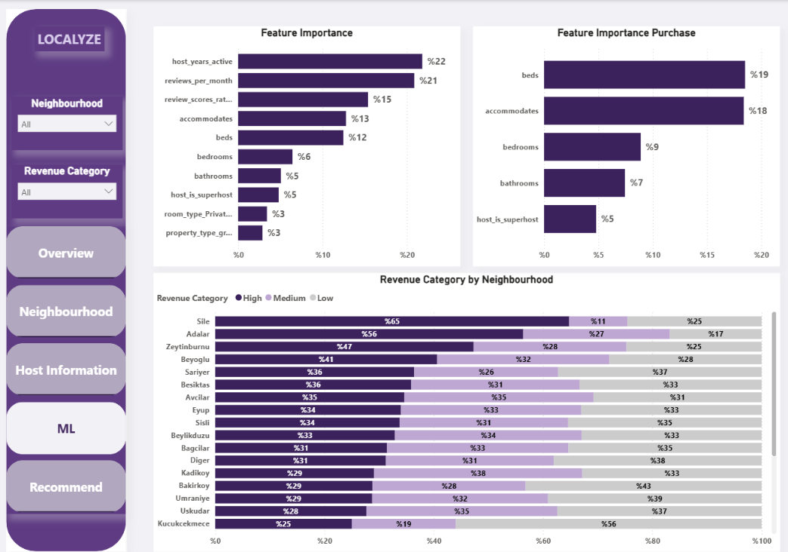
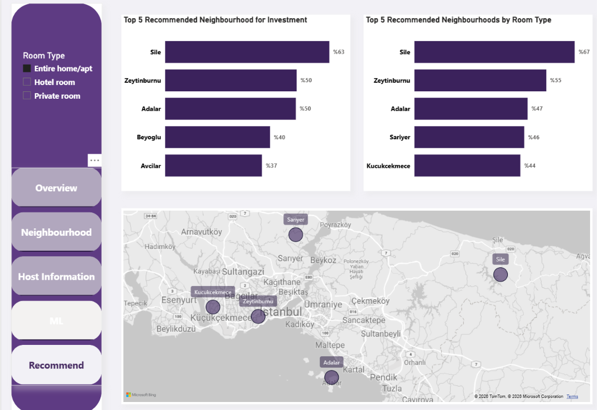

# 🏠 Airbnb İstanbul — Gelir Tahmini ve Bölge Önerisi

Airbnb İstanbul ilan verisini kullanarak yatırımcılara **en yüksek gelir potansiyeline sahip bölgeyi öneren** uçtan uca bir veri analitiği ve makine öğrenmesi projesi.

## 🎯 Problem Tanımı

Bir yatırımcı İstanbul'da Airbnb için mülk almak istediğinde hangi ilçeyi/bölgeyi seçmeli? Bu proje, geçmiş ilan verilerinden yola çıkarak tahmini yıllık gelir potansiyeline göre bölgeleri sıralıyor ve öneriyor.

## 🗂️ Veri Seti

Airbnb İstanbul ilan verisi (listings). Ana hedef değişken: **est_annual_revenue** (tahmini yıllık gelir), fiyat ve doluluk oranından türetildi.

## 🔧 Yöntem

**1. Keşifsel Veri Analizi (EDA) ve Temizlik**
- Aykırı değer temizleme (fiyat, minimum gecelik konaklama üzerinde %99'luk persentil ile kırpma)
- Nadir görülen `property_type` ve `neighbourhood` kategorilerinin gruplanması

**2. Özellik Mühendisliği**
- `host_years_active`, `price_per_accommodate`, `occupancy_rate_365`, `est_annual_revenue`, `reviews_per_month` gibi türetilmiş değişkenler
- Veri sızıntısını (data leakage) önlemek için `price` ve `availability_365` özellik matrisinden çıkarıldı

**3. Modelleme — İki Ayrı Analiz**

| Analiz | Hedef Değişken | Modeller |
|---|---|---|
| A) Regresyon | `est_annual_revenue` (sürekli) | Dummy, Linear Regression, Random Forest, XGBoost, CatBoost |
| B) Sınıflandırma | Gelir kategorisi (Düşük/Orta/Yüksek, qcut ile) | Logistic Regression, Random Forest, XGBoost, CatBoost |

**4. Bölge Sıralaması**
- Medyan tahmini gelire göre ilçe sıralaması (minimum 50 ilan şartıyla)

## 📊 Sonuçlar

**Regresyon (en iyi model: CatBoost)**
- RMSE: 402,559 · MAE: 262,896 · R²: 0.243

**Sınıflandırma (en iyi model: Random Forest)**
- Accuracy: 0.557 · F1: 0.554

**Yatırım İçin Önerilen İlk 5 İlçe** (yüksek gelir kategorisi oranına göre):
1. Şile — %63
2. Zeytinburnu — %50
3. Adalar — %50
4. Beyoğlu — %40
5. Avcılar — %37

*Not: Oda tipine göre filtrelendiğinde sıralama değişiyor — detaylar dashboard'da.*

## 📈 Power BI Dashboard — "LOCALYZE"

Bulgular interaktif bir Power BI dashboard'unda görselleştirildi:
- **Overview** — genel ilan ve fiyat dağılımı
- **ML** — özellik önem dereceleri (feature importance)
- **Recommend** — oda tipine göre filtrelenebilir ilçe önerileri ve harita

## ⚠️ Sınırlılıklar

- Gelir tahminidir, gerçek kazanç verisi değildir (brüt, net değil)
- Mülk alım/yatırım maliyeti verisi dahil edilmedi — yalnızca gelir potansiyeli değerlendirildi
- Şile ve Adalar gibi bölgelerde mevsimsellik etkisi olası
- Model R² değeri mütevazı (0.243) — korelasyon nedensellik anlamına gelmez

## 🛠️ Kullanılan Teknolojiler

`Python` (pandas, scikit-learn, XGBoost, CatBoost) · `Power BI` · `Jupyter Notebook`

**Hazırlayan:** Merve Şamdan · [LinkedIn] (www.linkedin.com/in/merve-samdan)

